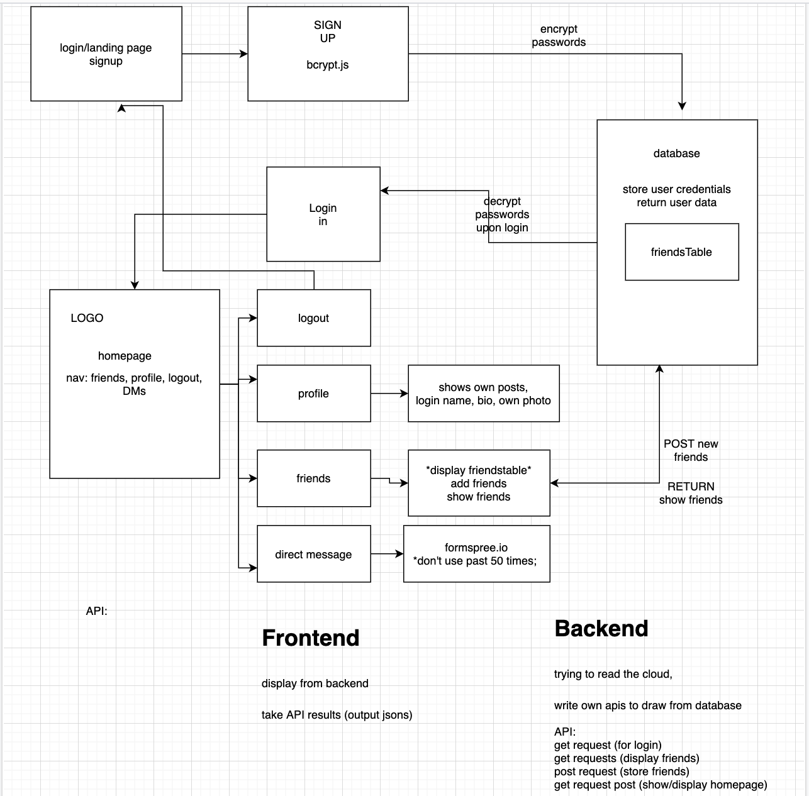

# ReachMe

## Description

- ReachMe is a social media application that focuses on connecting family and friends with posts, photos and comments.

## Website URL:

https://rocky-dawn-25327.herokuapp.com/

## Mission statement

- Streamlining social media experience
- Building an experience similar/comparable to Instagram application

## Functionality

Our app is a simple alternative to all the confusing social media applications.
A user can sign-in, add an image & caption, follow their friends, see their posts & comment on them.

## Logo

## Main Page

## Features

- Login/Logout feature
- Follow / Unfollow feature
- Add posts & Images
- Comment on your post & your friends posts
- Delete your own comment
- View your own User profile page and other profiles
- Displaying posts of people you’re following
- Easy to use, Friendly & Free
- Best of all, the app is free and compatible with Android and Apple devices

## Technologies used

- MERN Stack (Mongo, Express, React, Node)
- HTML, CSS, Bootstrap
- Javascript, Jquery
- MVC paradigm
- CRUD Operations
- React-Bootstrap
- NPM Packages
- draw.io (wire framing)
- Firebase (image handling)
- Mongo Atlas & Heroku (deployment)

## License

Copyright © 2020 | All rights reserved | ReachMe

## Architecture

